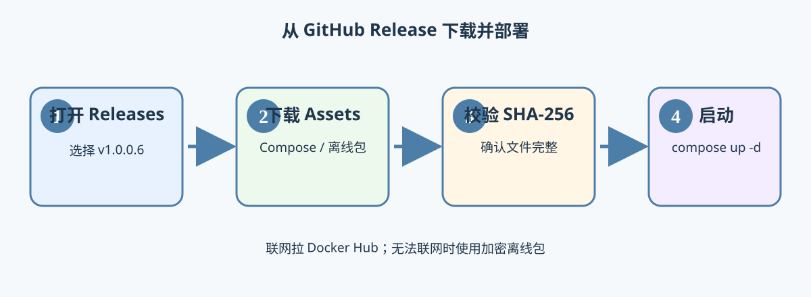

# StreamHarbor Docker ?????PostgreSQL + Redis + Celery?

????? **4 ???**????Celery Worker?PostgreSQL?Redis????? SQLite?????????????


## 1. ????

- **PostgreSQL**?????????????????
- **Redis**???????? Celery ???????????
- **Celery Worker**????????STRM ????????
- **StreamHarbor App**???????? Emby ???

???? `network_mode: host` ???? `app` ? `worker`?????? `127.0.0.1` ?? PostgreSQL?Redis??????????? NAS ???????????????

## 2. ????

```bash
mkdir -p /vol1/1000/docker/streamharbor/config
mkdir -p /vol1/1000/docker/streamharbor
```

??????`/vol1/1000/???`?????????

## 3. ?? .env


? `docker-compose.yml` ? `.env.example` ???????????

```bash
cd /vol1/1000/docker/streamharbor
cp .env.example .env
```

?? `.env`??????

```dotenv
PUBLIC_BASE_URL=http://??NAS??:8000
LIBRARY_ROOT=/vol1/1000/???
POSTGRES_PASSWORD=change_me_postgres_password
REDIS_PASSWORD=change_me_redis_password
GATEWAY_SECRET=change_me_to_a_long_random_secret_at_least_32_characters
```

??? URL ?????PostgreSQL?Redis ?????????????`_`?`-`?

## 4. Compose ????

```yaml
version: "3.8"

services:
  app:
    image: noway2004/streamharbor:v${STREAMHARBOR_VERSION:-1.0.0.7}
    restart: unless-stopped
    init: true
    network_mode: host
    environment:
      - DATABASE_URL=postgresql+psycopg://...@127.0.0.1:5432/streamharbor
      - REDIS_URL=redis://:...@127.0.0.1:6379/0
      - CELERY_BROKER_URL=redis://:...@127.0.0.1:6379/0
      - CELERY_RESULT_BACKEND=redis://:...@127.0.0.1:6379/1
      - TASK_MODE=celery
```

?????????

- `worker`??? `celery -A app.tasks.celery_app worker`?
- `postgres`????? `streamharbor_postgres_data`?
- `redis`????? `streamharbor_redis_data`?
- ????????????/Worker ????????????

> `app` ? `worker` ????????????????? `ports:`?8000 ?????? Emby ??????? NAS ???

## 5. ??

```bash
docker compose config
docker compose up -d
docker compose ps
docker compose logs -f app
docker compose logs -f worker
```

???`http://??NAS??:8000`?

## 6. ????



? `.env` ?????????

```dotenv
STREAMHARBOR_VERSION=1.0.0.7
```

```bash
docker compose pull
docker compose up -d
```

## 7. ????

```bash
# ?????? Worker????? Redis ????
docker compose restart app worker

# ????? PostgreSQL?Redis????????
docker compose down
```

**???? `docker compose down -v`**???????? PostgreSQL ? Redis ????????

## 8. ?? SQLite ??

????????? `pan115.db`????????????????????????????????? SQLite ? PostgreSQL ?????????????????
