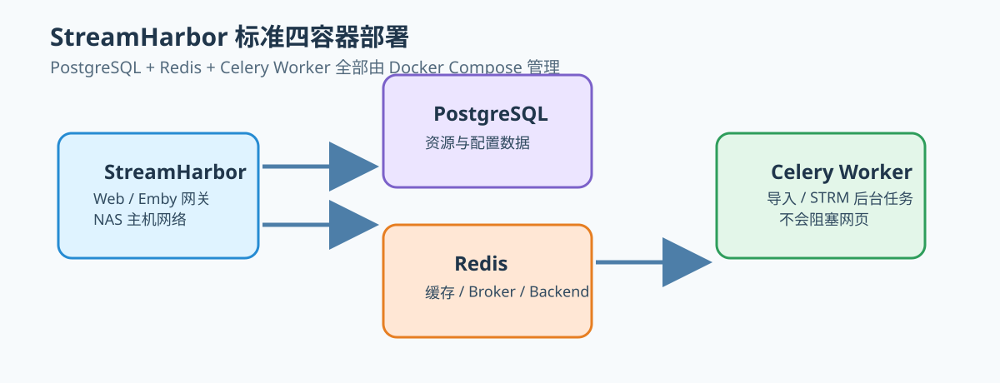
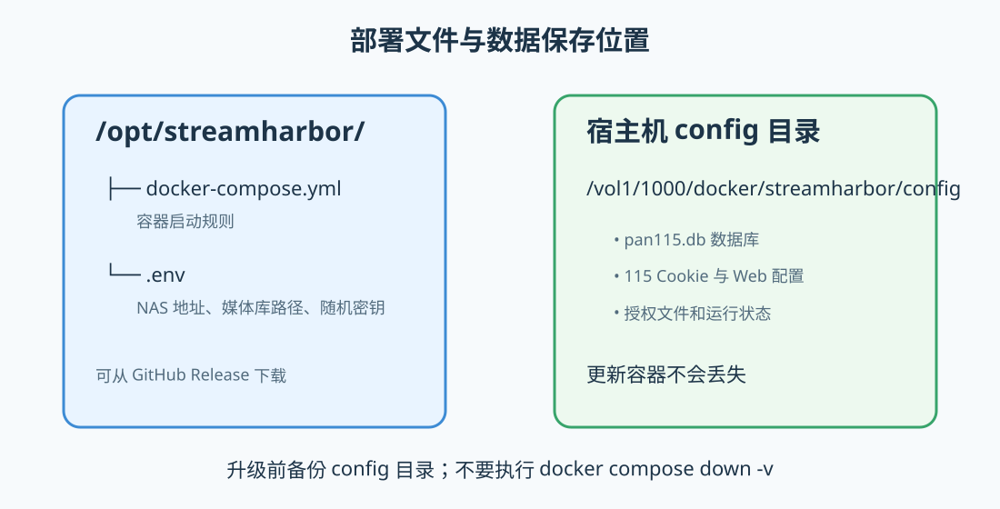

# StreamHarbor Docker 部署教程

本教程使用 **PostgreSQL + Redis + Celery Worker** 的标准四容器架构。Compose 文件已经把数据库、缓存和 Worker 一并配置好；你只需要准备两个文件、填写 `.env`，然后执行启动命令。



## 1. 服务结构

```text
浏览器 / Emby 客户端
        │
        ├── 8000 ──> StreamHarbor App（Web、115 网关、Emby 反向代理）
        │                         │
        │                         ├── PostgreSQL（资源与配置数据）
        │                         ├── Redis（缓存、Celery Broker、Result Backend）
        │                         └── Celery Worker（后台任务）
        │
        └── 影视库目录 <────────── STRM 文件
```

四个容器都由同一份 `docker-compose.yml` 管理：

- **app**：网页管理端口为 `8000`，并提供 Emby 反向代理。
- **worker**：执行后台队列任务，避免长时间导入阻塞网页请求。
- **postgres**：持久保存资源、分享、订阅和配置数据。
- **redis**：供 Celery 分发任务和保存结果，也用作应用缓存。

> App 和 Worker 使用主机网络，以便 NAS 上的 Emby 可以直接访问自定义反向代理端口。PostgreSQL 与 Redis 只映射到 `127.0.0.1`，不会直接暴露到局域网。

## 2. 创建宿主机目录

在 NAS SSH 终端执行：

```bash
mkdir -p /opt/streamharbor
mkdir -p /vol1/1000/docker/streamharbor/config
mkdir -p /vol1/1000/影视库
cd /opt/streamharbor
```

目录含义：

| 目录 | 用途 |
| --- | --- |
| `/opt/streamharbor` | 保存 `docker-compose.yml` 和 `.env`。 |
| `/vol1/1000/docker/streamharbor/config` | 保存应用运行文件、授权状态和 Web 配置。 |
| `/vol1/1000/影视库` | 保存生成的 STRM；Emby 媒体库也应读取此目录。 |

如果你的 NAS 实际路径不同，可以在 `.env` 中改成自己的路径；Compose 左右两侧的媒体库路径会保持一致。

## 3. 下载并准备文件

从 GitHub 仓库或 Release 下载：

```text
docker-compose.yml
.env.example
```

放入 `/opt/streamharbor/` 后执行：

```bash
cd /opt/streamharbor
cp .env.example .env
```



## 4. 编辑 `.env`

使用 NAS 的文本编辑器打开 `/opt/streamharbor/.env`：

```dotenv
STREAMHARBOR_VERSION=1.0.0.10
TZ=Asia/Shanghai
PUBLIC_BASE_URL=http://你的NAS地址:8000
CONFIG_PATH=/vol1/1000/docker/streamharbor/config
LIBRARY_ROOT=/vol1/1000/影视库

POSTGRES_PASSWORD=请替换为强密码
REDIS_PASSWORD=请替换为强密码
GATEWAY_SECRET=请替换为至少32位的随机字符串
```

需要修改的项目：

1. `PUBLIC_BASE_URL`：将“你的NAS地址”替换为 NAS 的 IP 或域名，例如 `http://192.168.50.220:8000`。
2. `CONFIG_PATH`：保存 StreamHarbor 配置、Cookie 和授权状态的目录。
3. `LIBRARY_ROOT`：STRM 生成目录；必须与 Emby 添加的媒体库路径一致。
4. `POSTGRES_PASSWORD`、`REDIS_PASSWORD`：替换 `change_me` 示例密码。
5. `GATEWAY_SECRET`：替换为至少 32 位随机字符串。部署稳定后不要随意修改。

`.env` 是私密文件，**禁止上传到 GitHub**。

## 5. 启动

```bash
cd /opt/streamharbor

# 先检查 Compose 变量和语法
docker compose config

# 拉取 v1.0.0.10 镜像并启动全部四个容器
docker compose pull
docker compose up -d

# 确认状态
docker compose ps
```

正常情况下会看到：

```text
streamharbor            running
streamharbor-worker     running
streamharbor-postgres   healthy
streamharbor-redis      healthy
```

打开 Web 管理页：

```text
http://你的NAS地址:8000
```

首次进入后，在 Web 页面填写 115 Cookie、授权信息、Telegram 和 Emby 配置。真实 Cookie 和授权只保存在你的 NAS，不应写入 Compose 或 GitHub。

## 6. Emby 设置

1. 在 Emby 中把 `LIBRARY_ROOT` 对应的宿主机目录添加为媒体库，例如 `/vol1/1000/影视库`。
2. 在 StreamHarbor Web 页面填写真实 Emby 地址，例如 `http://192.168.50.220:8096`。
3. 填写 Emby API Key，并设置一个未被占用的反向代理端口，例如 `8097`。
4. Emby 客户端连接 `http://你的NAS地址:8097`；管理页面仍然使用 `8000` 端口。

## 7. 查看日志与后台任务

```bash
# Web 应用日志
docker compose logs -f app

# Celery Worker 日志
docker compose logs -f worker

# PostgreSQL 日志
docker compose logs --tail=100 postgres

# Redis 日志
docker compose logs --tail=100 redis
```

如果页面可以打开但导入、校验或生成 STRM 一直不动，请优先检查 `worker` 日志和 Redis 状态。

## 8. 更新版本

每次修复仅递增第四段版本号，例如 `v1.0.0.9` 升级为 `v1.0.0.10`。在 `.env` 中修改：

```dotenv
STREAMHARBOR_VERSION=1.0.0.10
```

然后执行：

```bash
cd /opt/streamharbor
docker compose pull
docker compose up -d
docker compose ps
```

升级前建议备份：

```bash
cp -a /vol1/1000/docker/streamharbor/config \
  /vol1/1000/docker/streamharbor/config-backup-$(date +%Y%m%d-%H%M%S)
```

## 9. 常见问题

### 页面无法打开

```bash
docker compose ps
docker compose logs --tail=200 app
```

确认 NAS 防火墙允许 `8000`，并确认 `.env` 的 `PUBLIC_BASE_URL` 使用真实 NAS 地址。

### Worker 没有运行

```bash
docker compose logs --tail=200 worker
docker compose logs --tail=100 redis
```

确认 `TASK_MODE=celery`，且 `streamharbor-worker`、`streamharbor-redis` 都是运行状态。

### PostgreSQL 或 Redis 无法启动

检查 `.env` 中的密码是否仍是示例值，查看对应容器日志，并确认 `5432`、`6379` 没有被 NAS 本机其他服务占用。

### 不要使用以下命令

```bash
docker compose down -v
```

该命令会删除 PostgreSQL 与 Redis 的命名卷，数据将无法恢复。日常停止使用：

```bash
docker compose down
```
